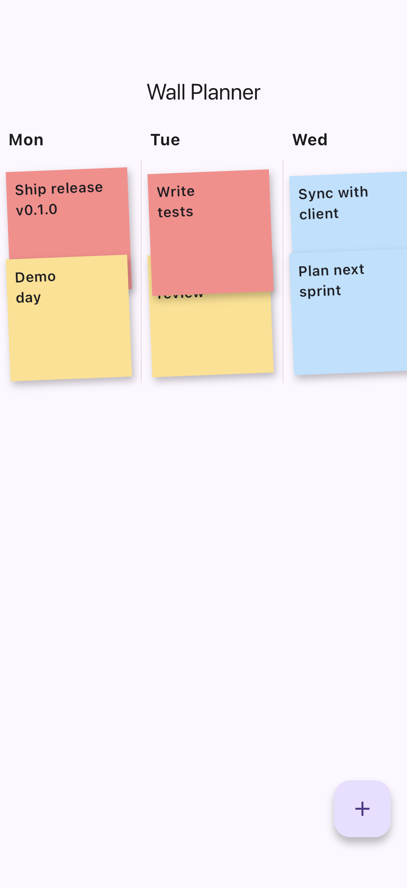
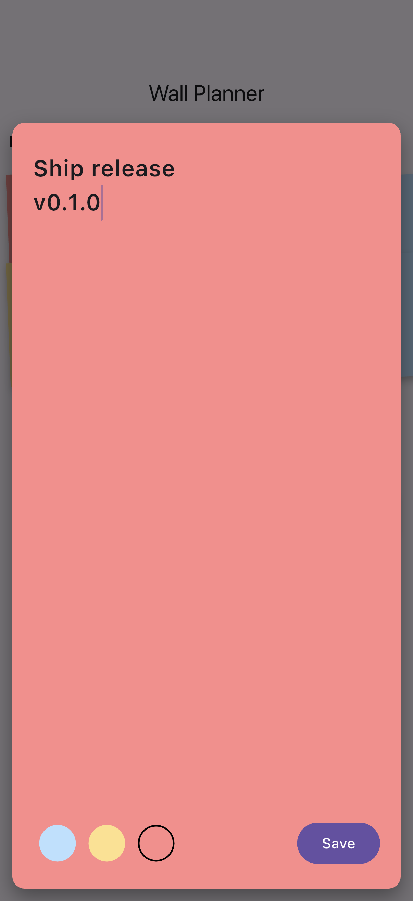
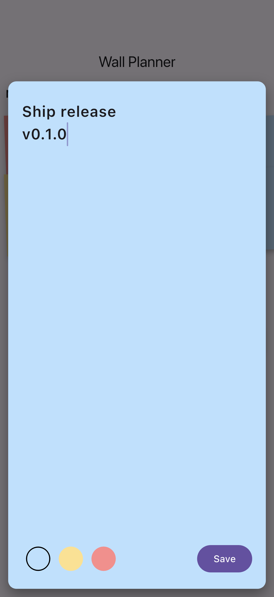

# Flutter Sticky Notes Kanban

Tactile sticky-note planning POC. Drag/drop notes onto a 7-day timeline, "rip" notes to complete (with escalating haptics), full-screen edit zoom, priority colors, local Hive persistence.

## Demo

Real captures from the running app on the iOS Simulator (not mockups). See [FLOW.md](FLOW.md) for how they are generated.

| Week board | Zoom editor | Priority picker |
| --- | --- | --- |
|  |  |  |


## Features

- Draggable sticky notes with snapping to weekday lanes (Mon-Sun)
- Spring-back snap animation (AnimatedPositioned + easeOutBack)
- Long-press to open full-screen zoom editor (Hero transition)
- "Rip to complete" vertical drag gesture with haptic ramp (selection -> heavy impact)
- Priority colors (low/medium/high), tap chip to change
- Hive persistence (manual TypeAdapters, no codegen)
- Riverpod state management
- Material 3, custom warm cork-board theme

## Stack

Flutter 3.41, Dart 3.5, Riverpod, Hive, Material 3, CustomPainter, HapticFeedback, GestureDetector.

## Run

```bash
flutter pub get
flutter run
```

## Architecture

- `data/note_store.dart` - StickyNote model + Hive adapters + Riverpod StateNotifier
- `ui/board_screen.dart` - Weekly board lanes + draggable note positioning
- `ui/sticky_note_card.dart` - Per-note rip gesture, tilt, shadow
- `ui/note_zoom_sheet.dart` - Full-screen edit with priority picker

## Inspired by

Physical sticky-note walls for project planning. Tactile UX over enterprise task management.
